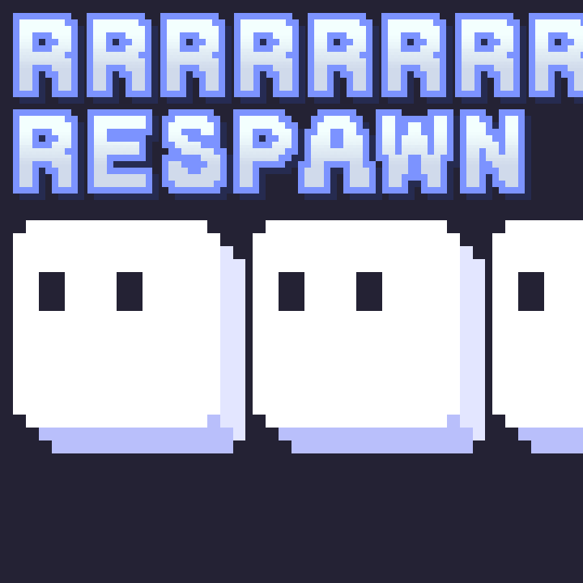

# RRRRRRRRespawn

[Bevy Game Jam #4](https://itch.io/jam/bevy-jam-4)

**Instructions**

- Collect all stars

**Controls**

- Left / A - Move Left
- Right / D - Move Right
- Space - Jump
- R - Reset
- X - Split into two

## Changelog

- `v0.1.0`:  initial release

## Copyright / Licenses

### Fonts

- [Puzzle](https://emhuo.itch.io/peaberry-pixel-font), SIL Open Font License. Designed by Emily Huo.

> Copyright (c) 2021, Emily Huo (mlyhuo@gmail.com, emuhuo.itch.io, emhuo.com).
>
> This Font Software is licensed under the SIL Open Font License, Version 1.1.
> This license is copied below, and is also available with a FAQ at:
> http://scripts.sil.org/OFL

### Background Music

- [Three Red Hearts - Puzzle Pieces](https://tallbeard.itch.io/three-red-hearts-prepare-to-dev) by [Abstraction](http://abstractionmusic.bandcamp.com/) is licensed under Creative Commons: By Attribution 4.0 International.

### Other

- https://github.com/bevyengine/bevy_github_ci_template
